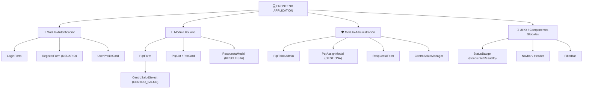

```mermaid
graph TD
    App["💻 FRONTEND APPLICATION"]
    
    %% Auth
    App --> AuthMod["🔐 Módulo Autenticación"]
    AuthMod --> C1["LoginForm"]
    AuthMod --> C2["RegisterForm (USUARIO)"]
    AuthMod --> C3["UserProfileCard"]
    
    %% Usuario
    App --> UserMod["👤 Módulo Usuario"]
    UserMod --> C4["PqrForm"]
    C4 --> C4_1["CentroSaludSelect (CENTRO_SALUD)"]
    UserMod --> C5["PqrList / PqrCard"]
    UserMod --> C6["RespuestaModal (RESPUESTA)"]

    %% Admin
    App --> AdminMod["🛡️ Módulo Administración"]
    AdminMod --> C7["PqrTableAdmin"]
    AdminMod --> C8["PqrAssignModal (GESTIONA)"]
    AdminMod --> C9["RespuestaForm"]
    AdminMod --> C10["CentroSaludManager"]

    %% UI Kit
    App --> UIKit["🎨 UI Kit / Componentes Globales"]
    UIKit --> C11["StatusBadge (Pendiente/Resuelto)"]
    UIKit --> C12["Navbar / Header"]
    UIKit --> C13["FilterBar"]
```